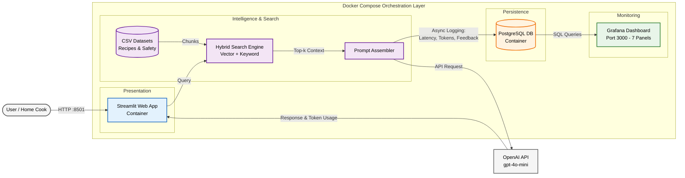

# Sushi Master & Food Safety Assistant

A smart conversational assistant that helps home cooks and beginners learn sushi recipes, preparation techniques, and strict raw food safety guidelines. 

Built as a capstone project for LLM Zoomcamp.

---

## Demo

* Web UI: Access locally via browser at http://localhost:8501
* Monitoring Dashboard: Access Grafana at http://localhost:3000 (Login: `admin` / `admin`)

---

## Problem

Making sushi at home can be intimidating. Beginners often struggle with precise rice-to-vinegar ratios, rolling mechanics, and critical food safety rules. Handling raw fish like salmon and tuna requires strict knowledge of parasite destruction methods, safe commercial freezing requirements, and cross-contamination prevention.

The Sushi Master & Food Safety Assistant is a RAG (Retrieval-Augmented Generation) application designed to help with:
* Sushi Recipes & Preparation: Providing step-by-step instructions for popular sushi rolls, ingredient proportions, and rolling techniques.
* Food Safety Guidelines: Explaining parasite risks in raw seafood, commercial freezing requirements, and temperature safety controls.
* Interactive Web Interface: A clean, user-friendly frontend built with Streamlit.
* Production Observability: Real-time logging of conversations, token costs, latency, and user feedback (thumbs up/down) directly into PostgreSQL and visualized via Grafana.

---
## Architecture

The application is fully containerized and orchestrated via Docker Compose, separating internal containerized services from external APIs:

## Quickstart

The easiest way to run the complete application stack is using Docker Compose:

1. Create a `.env` file in the root directory and add your OpenAI API key and database settings:
   ~~~env
   OPENAI_API_KEY=your_openai_api_key_here
   POSTGRES_USER=postgres
   POSTGRES_PASSWORD=postgres
   POSTGRES_DB=sushi_db
   ~~~

2. Build and start all services (Streamlit app, PostgreSQL, and Grafana):
   ~~~bash
   docker compose up --build -d
   ~~~

* Streamlit App: http://localhost:8501
* Grafana Dashboard: http://localhost:3000

---

## Prerequisites

* Python 3.12+
* Docker and Docker Compose
* OpenAI API Key
* `uv` for fast dependency management

---

## Full Setup (Running Python Locally with Docker Services)

If you want to run the Streamlit app directly on your host machine while keeping the database and Grafana containerized:

1. Start the backend infrastructure containers:
   ~~~bash
   docker compose up postgres grafana -d
   ~~~

2. Install dependencies and sync your virtual environment using `uv`:
   ~~~bash
   uv sync
   ~~~

3. Run the Streamlit application:
   ~~~bash
   uv run streamlit run app.py
   ~~~

4. Initialize the Grafana monitoring dashboard:
   ~~~bash
   cd grafana
   uv run python init.py
   ~~~

---

## Experimentation & Evaluation

You can run experimentation and evaluation pipelines locally using Jupyter Lab:
~~~bash
uv run jupyter lab
~~~

### Retrieval Evaluation
* Dataset: Curated Q&A pairs covering sushi recipes and seafood safety guidelines (`data/sushi-ground-truth-retrieval.csv`).
* Evaluated across **365 ground truth questions**.
* Metrics: Achieved a **Hit Rate of 98.36%** and a **Mean Reciprocal Rank (MRR) of 0.677** to ensure accurate chunk retrieval prior to text generation.

### RAG Flow & LLM-as-a-Judge
* Responses evaluated using `gpt-4o-mini` on a test batch of **50 samples** to balance cost and factual accuracy regarding food safety thresholds and recipe proportions.
* Results breakdown: **96% RELEVANT** and **4% PARTLY_RELEVANT**.

---

## Monitoring with Grafana

Grafana runs at http://localhost:3000 (`admin` / `admin`).

The dashboard tracks production metrics across 7 key panels:
1. **Last 5 conversations:** Real-time table displaying recent user queries, model answers, timestamps, and feedback ratings.
2. **User feedback:** Tracks individual thumbs-up/down user ratings over time.
3. **Feedback breakdown:** Categorized distribution ratio of positive versus negative user feedback ratings.
4. **OpenAI cost:** Time-series tracking of accumulated API expenses per request.
5. **Token usage:** Monitors prompt and completion token consumption volumes.
6. **Model used breakdown:** Distribution chart showing which LLM models served the requests.
7. **Response time:** Tracks system latency and query execution speed end-to-end.

All dashboard auto-provisioning scripts and configurations are managed inside the `grafana/` directory (`dashboard.json`, `init.py`).

---

## Design Decisions & Trade-offs

* **Streamlit over Custom Frontend:** Streamlit was chosen for rapid UI prototyping and built-in interactive chat components, avoiding the overhead of a separate React/JS client.
* **GPT-4o-mini over GPT-4o:** Selected for its optimal balance of fast response times, low token cost, and high performance on domain-specific culinary retrieval tasks.
* **PostgreSQL Logging:** Every user query, generated response, token count, and feedback rating is captured in relational tables for real-time observability via Grafana.

---

## Project Structure

~~~text
sushi-assistant/
├── app.py                      # Streamlit web interface & main entrypoint
├── Dockerfile                  # Container build instructions for Streamlit app
├── docker-compose.yaml         # Multi-container orchestration (App + Postgres + Grafana)
├── pyproject.toml              # Project dependencies & configuration
├── uv.lock                     # uv dependency lock file
├── data/                       # 📁 Data Folder (shared between app and notebooks)
│   ├── OneRoll_updated.csv     # Sushi recipes, ingredients, and preparation steps
│   ├── food_safety.csv         # Food safety, parasite risks, and temperature guidelines
│   ├── sushi-ground-truth-retrieval.csv # Ground-truth query-document pairs
│   └── rag-eval-results.csv    # Evaluation metrics and test results
├── notebooks/                  # 📁 RAG Experimentation & Evaluation
│   ├── generate_questions.ipynb # Auto-generate test queries and ground truth
│   └── evaluation_and_rag.ipynb # Building, testing, and evaluating RAG pipelines
├── src/                        # 📁 Application Source Code
│   ├── rag.py                  # RAG logic (retrieval + OpenAI prompt generation)
│   ├── vector_index.py         # Vector search indexing configuration
│   ├── keyword_index.py        # Keyword search fallback implementation
│   └── logger.py               # Database interaction and logging utilities
└── grafana/                    # 📁 Monitoring & Observability
    ├── dashboard.json          # Grafana monitoring dashboard configuration
    └── init.py                 # Automated Grafana setup script
~~~

---

## Limitations

* Requires an active internet connection and a valid OpenAI API key.
* Dataset focuses primarily on featured sushi recipes and standard seafood safety parameters.
* In-memory indexing requires re-ingestion upon application restart.

---

## About

This project was built as a capstone application for LLM Zoomcamp, focusing on building production-ready LLM applications with rigorous observability and evaluation.