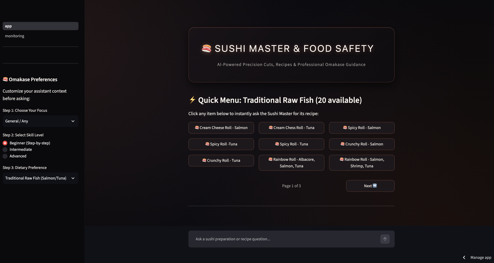
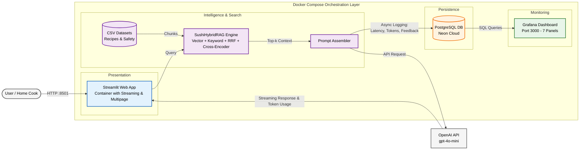
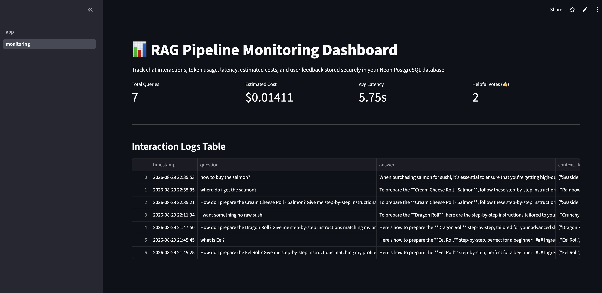
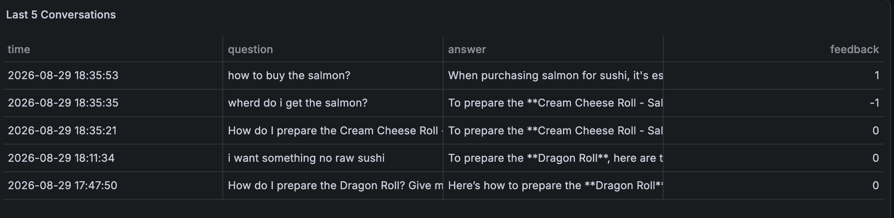
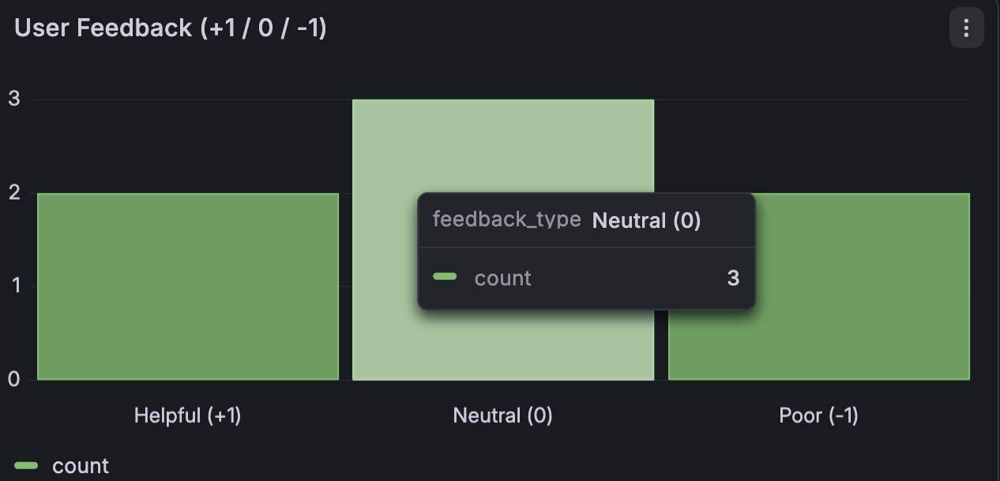
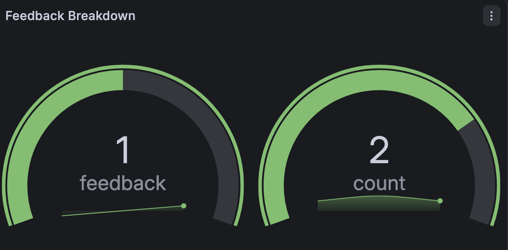
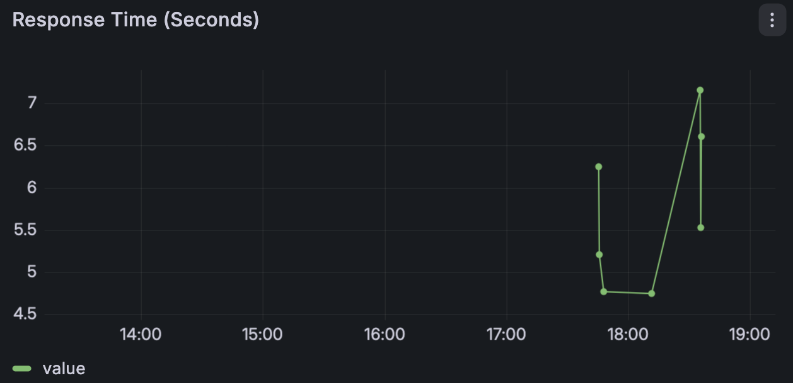
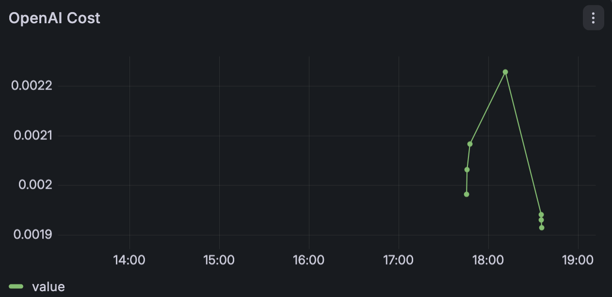
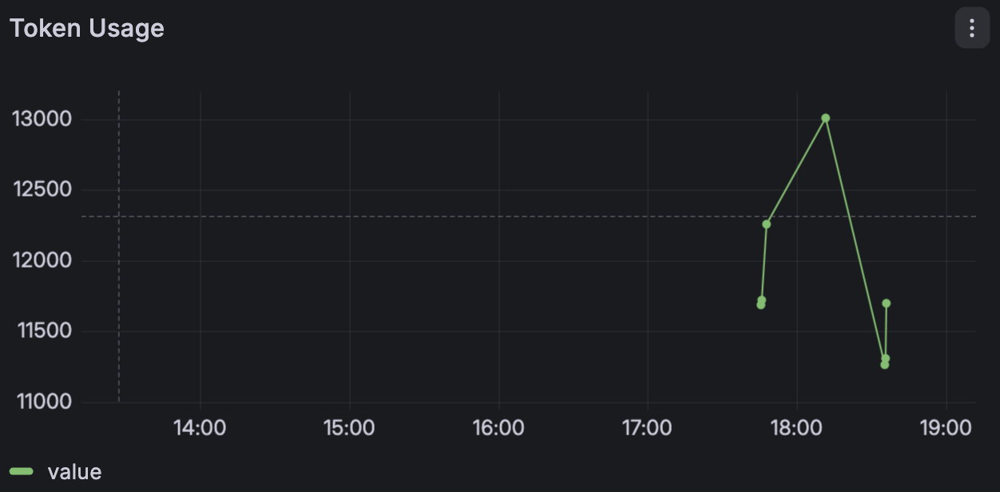
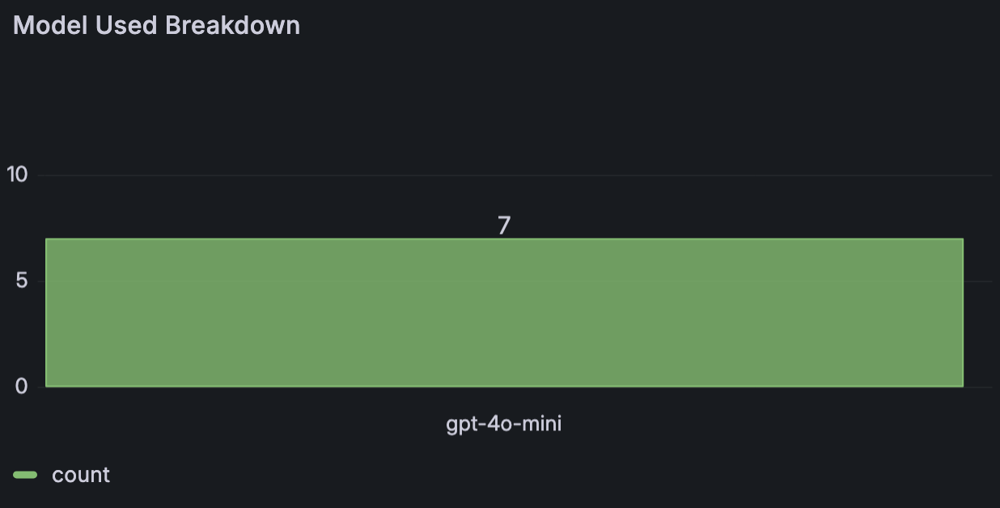

# Sushi Master & Food Safety Assistant 🍣

A smart, production-grade conversational Hybrid RAG assistant that helps home cooks and beginners learn sushi recipes, preparation techniques, and strict raw food safety guidelines. Built as a capstone project for **LLM Zoomcamp**.

---


## 🖥️ Application Interface

The Streamlit UI provides a clean, customized experience with selectable skill levels, focus areas, and dietary preferences alongside a quick-access raw fish menu.

<p align="center">
  
</p>

---

## Demo & Hosting

* **Live Production Hosting:** [https://sushi-master-ai.streamlit.app](https://sushi-master-ai.streamlit.app) *(Deployed on Streamlit Community Cloud)*
* **Local Web UI:** Access locally via browser at `http://localhost:8501`
* **Monitoring Dashboard:** Access Grafana at `http://localhost:3000` (Login: `admin` / `admin`)

---

## Problem & Overview

Making sushi at home can be intimidating. Beginners often struggle with precise rice-to-vinegar ratios, rolling mechanics, and critical food safety rules. Handling raw fish like salmon and tuna requires strict knowledge of parasite destruction methods, safe commercial freezing requirements, and cross-contamination prevention.

The Sushi Master & Food Safety Assistant utilizes a production-grade **Hybrid RAG (`SushiHybridRAG`)** architecture designed to help with:
* **Sushi Recipes & Preparation:** Step-by-step instructions for popular sushi rolls, ingredient proportions, and rolling techniques.
* **Food Safety Guidelines:** Parasite risks in raw seafood, commercial freezing requirements, and temperature safety controls.
* **Real-Time Streaming Interface:** Clean, responsive frontend built with Streamlit supporting live token streaming and dedicated multipage telemetry views.
* **Production Observability:** Real-time logging of conversations, token costs, latency, and user feedback (thumbs up/down) directly into Neon PostgreSQL and visualized via Grafana and Streamlit pages.

---

## Architecture

The application is fully containerized and orchestrated via Docker Compose, separating internal containerized services from external APIs:



---

## Quickstart (Docker Compose)

The easiest way to run the complete application stack locally:

1. Create a `.env` file in the root directory and add your OpenAI API key and database connection string:
   ```env
   OPENAI_API_KEY=your_openai_api_key_here
   DATABASE_URL=your_neon_postgresql_connection_string_here
   ```

2. Build and start all services (Streamlit app, PostgreSQL, and Grafana):
   ```bash
   docker compose up --build -d
   ```

* Streamlit App: `http://localhost:8501`
* Grafana Dashboard: `http://localhost:3000`

---

## Prerequisites & Modern Tooling

* Python 3.12+
* Docker and Docker Compose
* OpenAI API Key
* **`uv`** for lightning-fast Python dependency management (`pyproject.toml` / `uv.lock`)

---

## Full Local Development Setup (Python + Docker Services)

If you want to run the Streamlit app directly on your host machine while keeping the database and Grafana containerized:

1. Start the database and monitoring infrastructure containers:
   ```bash
   docker compose up postgres grafana -d
   ```

2. Synchronize your virtual environment using `uv`:
   ```bash
   uv sync
   ```

3. Run the Streamlit application:
   ```bash
   uv run streamlit run app.py
   ```

4. Initialize the Grafana monitoring dashboard:
   ```bash
   cd grafana
   uv run python init.py
   ```

---

## Experimentation & Evaluation

The system includes comprehensive retrieval and generation evaluation pipelines located in `notebooks/evaluation_and_rag.ipynb`.

### 1. Retrieval Evaluation (Hit Rate & MRR)
* **Dataset:** Curated ground-truth dataset (`data/sushi-ground-truth-retrieval.csv`) containing query-document pairs covering sushi recipes and seafood safety guidelines.
* **Evaluation Scale:** Evaluated across **365 ground-truth test questions**.
* **Methodology:** Tests the performance of the `SushiHybridRAG` engine combining semantic vector search (`SentenceTransformers`), keyword search (`sqlitesearch`), Reciprocal Rank Fusion (RRF), and Cross-Encoder re-ranking (`ms-marco-MiniLM-L-6-v2`).
* **Results:**
  * **Hit Rate (@5):** **98.36%** (percentage of test queries where the relevant chunk was retrieved in the top 5 results).
  * **Mean Reciprocal Rank (MRR):** **0.677** (reflecting high ranking precision of the top retrieved context).

### 2. RAG Flow & LLM-as-a-Judge Evaluation
* **Evaluation Script:** Automated assessment script leveraging `gpt-4o-mini` as an independent judge.
* **Test Sample Size:** Evaluated on a test batch of **50 sampled interactions** to measure factual adherence, recipe proportion accuracy, and safety guideline compliance.
* **Metrics & Results Breakdown:**
  * **RELEVANT:** **96%** (responses that accurately answered the user prompt, correctly cited safety parameters like parasite freezing rules, and maintained precise recipe ratios).
  * **PARTLY_RELEVANT:** **4%** (responses that addressed the general topic but lacked specific nuance or required minor follow-up).
  * **IRRELEVANT:** **0%**.
* **Output Logs:** Evaluation summaries and judge feedback logs are automatically exported to `data/rag-eval-results.csv`.

---

## 📈 Monitoring & Observability

The application tracks live chat interactions, token counts, model latency, estimated costs, and user feedback securely stored in a Neon PostgreSQL database.

### 1. Streamlit Monitoring Dashboard
<p align="center">
  
</p>

### 2. Grafana Production Telemetry Dashboards
To monitor production performance and user interactions in real time, the following Grafana dashboards are integrated:
Grafana runs at `http://localhost:3000` (`admin` / `admin`), tracking production metrics across 7 key panels:
* **Recent Interactions & Feedback Logs**
  <p align="center">
    
  </p>

* **User Feedback Analytics**
  <p align="center">
    
    
  </p>

* **Performance & Cost Metrics**
  <p align="center">
    
    
  </p>

* **Token Consumption & Model Breakdown**
  <p align="center">
    
    
  </p>

---

## Design Decisions & Trade-offs

* **Streamlit over Custom Frontend:** Streamlit was chosen for rapid UI prototyping, built-in interactive chat components, native real-time token streaming support, and multipage architecture (`pages/`), avoiding the overhead of a separate React/JS client.
* **GPT-4o-mini over GPT-4o:** Selected for its optimal balance of fast response times, low token cost, and high performance on domain-specific culinary retrieval tasks.
* **Neon PostgreSQL Logging:** Every user query, generated response, token count, latency, and feedback rating is captured in cloud relational tables for real-time observability via Grafana.

---

## Project Structure

```text
sushi-master-ai/
├── app.py                      # Main Streamlit application entrypoint & chat UI
├── data/                       # 📁 Shared Datasets & Evaluation Files
│   ├── OneRoll_updated.csv     # Sushi recipes, ingredients, and preparation steps
│   ├── food_safety.csv         # Food safety, parasite risks, and temperature guidelines
│   ├── sushi-ground-truth-retrieval.csv # Ground-truth query-document pairs
│   └── rag-eval-results.csv    # Evaluation metrics and test results
├── docker-compose.yaml         # Multi-container orchestration (App + Postgres + Grafana)
├── Dockerfile                  # Container build instructions for Streamlit app
├── grafana/                    # 📁 Observability & Monitoring
│   ├── dashboard.json          # Grafana monitoring dashboard configuration (7 panels)
│   └── init.py                 # Automated Grafana setup and provisioning script
├── notebooks/                  # 📁 RAG Experimentation & Evaluation
│   ├── generate_questions.ipynb # Auto-generate test queries and ground truth datasets
│   └── evaluation_and_rag.ipynb # Building, tuning, and evaluating retrieval metrics
├── pages/                      # 📁 Streamlit Multipage Directory
│   └── monitoring.py           # Application telemetry & monitoring view
├── Plans.docx                  # Project planning, architecture notes, and roadmap
├── pyproject.toml              # Modern Python dependency configuration managed by uv
├── README.md                   # Project documentation
├── src/                        # 📁 Application Source Code
│   ├── __init__.py             # Package initializer
│   ├── rag.py                  # Core SushiHybridRAG logic (hybrid search, RRF, cross-encoder, streaming)
│   ├── vector_index.py         # Semantic vector search indexing configuration
│   ├── keyword_index.py        # Keyword search implementation (`sqlitesearch`)
│   └── logger.py               # Neon PostgreSQL interaction and logging utilities
└── uv.lock                     # uv dependency lock file
```

---

## Limitations & Production Hosting

* Requires an active internet connection and valid OpenAI and Neon database API credentials.
* Dataset focuses primarily on featured sushi recipes and standard seafood safety parameters.
* Live cloud hosting is fully supported via container deployment on platforms like Render, AWS ECS, or Streamlit Community Cloud connected to the Neon PostgreSQL instance.

---

## About

Built as a capstone project for **LLM Zoomcamp**, focusing on production-grade Retrieval-Augmented Generation, hybrid search optimization (RRF + Cross-Encoder), real-time streaming responses, multipage architecture, and rigorous observability via Grafana and evaluation pipelines.